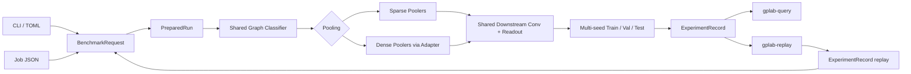

# Graph Pooling Lab (GPLab)

GPLab is a lightweight benchmark harness for graph pooling methods on graph
classification tasks. Its core abstraction is a `BenchmarkCase`: a dataset,
model, pooling method, and training protocol executed under one fixed benchmark
protocol.

Read [PROTOCOL.md](PROTOCOL.md) for the stable benchmark rules. Automation
clients should also read [AGENT_REFERENCE.md](AGENT_REFERENCE.md).



## Scope

`BenchmarkRequest` is the executable request wrapper around a `BenchmarkCase`
and `ExecutionOptions`. `PreparedRun` adds the loaded dataset profile and
resolved `RunPlan` with concrete seeds and split indices.

All executable entrypoints adapt into the same request object first:

- human CLI / TOML options build a `BenchmarkRequest`
- Job JSON validates into a `BenchmarkRequest`
- replay rebuilds a `BenchmarkRequest` from an `ExperimentRecord`

`request.case_id` identifies the benchmark-defining case. `request.to_mapping()`
is used only when GPLab needs to print a request-shaped JSON payload, such as a
replay job.

GPLab currently targets:

- TU datasets only
- graph classification only
- one pooling stage per model
- one shared downstream path after pooling

It is a benchmark harness, not a general-purpose graph learning framework.

## Layout

```text
src/gplab/
  benchmark/      # BenchmarkCase, BenchmarkRequest, RunPlan, comparison keys
  cli/            # gplab-* entrypoints
  data/           # TU loading and split helpers
  experiment/     # execution, record, result assembly
  jobs/           # Job JSON schema and request adapter
  layers/         # conv/pool resolver and pooling adapters
  model/          # shared graph classifier backbone
```

## Install

```bash
conda activate torch_env
python3 -m pip install -e .
```

GPLab depends on PyTorch, PyG, Typer, Rich, TOML, NumPy, and tqdm.

## Quick Start

Run one human-oriented experiment:

```bash
gplab-train --pool sagpool --pool-ratio 0.5 --dataset PROTEINS
```

Use the plain model variant:

```bash
gplab-train --pool sagpool --pool-ratio 0.5 --dataset PROTEINS --model-variant plain
```

Append the record to a JSONL log:

```bash
gplab-train \
  --pool sparsepool \
  --pool-ratio 0.5 \
  --dataset PROTEINS \
  --log-file runs/bench.jsonl \
  --tag baseline_proteins
```

Replay an exact seed list:

```bash
gplab-train \
  --pool diffpool \
  --pool-ratio 0.5 \
  --dataset PROTEINS \
  --seed-mode list \
  --seed-list 101,202,303
```

`gplab-train` is a human convenience entrypoint. Automation should use
`gplab-run-job` with Job JSON.

## Job JSON

Machine-facing execution uses Job JSON. This is the agent-facing request format;
GPLab fills optional defaults, then validates the result into
`BenchmarkRequest` before execution.

A Job JSON describes exactly one experiment case. It is not a batch manifest:
dataset, pool, ratio, model, and training settings are single values.

```json
{
  "case": {
    "dataset": "PROTEINS",
    "pool": {
      "name": "sagpool",
      "ratio": 0.5,
      "nonlinearity": "tanh"
    },
    "model": {
      "hidden_features": 128,
      "nonlinearity": "relu",
      "p_dropout": 0.0,
      "conv_layer": "GCN",
      "pre_gnn": [128],
      "post_gnn": [256, 128],
      "variant": "sum"
    },
    "training": {
      "runs": 10,
      "lr": 0.0005,
      "batch_size": 32,
      "patience": 50,
      "epochs": 500,
      "split": {
        "train": 0.8,
        "val": 0.1
      },
      "seeds": {
        "mode": "auto",
        "base": 20260320,
        "values": null,
        "allow_duplicates": false
      }
    }
  },
  "execution": {
    "log_file": null,
    "tag": null,
    "activation_checkpoint": false
  }
}
```

Run the job:

```bash
gplab-run-job --job-file job.json --output-format json
```

Or pass JSON directly:

```bash
gplab-run-job --job-json '{"case":{"dataset":"MUTAG","pool":{"name":"nopool","ratio":0.5},"training":{"runs":1,"epochs":1,"patience":0}}}' --output-format json
```

Or from stdin:

```bash
cat job.json | gplab-run-job --job-stdin --output-format json
```

`gplab-run-job` validates the job before execution. With `--output-format json`,
invalid jobs return `ok=false`, `kind="job_error"`, `error.type="config_error"`,
and a field-specific message for the agent to fix and retry.
Successful responses include the canonical `record`, a derived `summary`, and a
small `context` object describing the entry source.

With `--output-format json`, stdout is reserved for the single JSON response.
Progress and third-party output are redirected to stderr.

One `gplab-run-job` process executes exactly one Job JSON request and produces
one `ExperimentRecord`. If an agent schedules many cases concurrently, it must
use one process per case. Do not let multiple processes append to the same
`execution.log_file`; use separate JSONL files or serialize writes externally.

## Automation Entrypoints

- `gplab-run-job`: execute one Job JSON request.
- `gplab-query`: summarize JSONL records.
- `gplab-replay`: rebuild and optionally rerun one record.

## Supported Datasets

- `MUTAG`
- `PROTEINS`
- `ENZYMES`
- `FRANKENSTEIN`
- `Mutagenicity`
- `AIDS`
- `DD`
- `NCI1`
- `COX2`

## Pooling Methods

Built-in pools:

- `nopool`
- `topkpool`
- `sagpool`
- `asapool`
- `sparsepool`
- `mincutpool`
- `diffpool`
- `densepool`

Sparse poolers operate directly on sparse graph batches. Dense poolers are
wrapped by `DensePoolAdapter`, which converts sparse input batches to dense
tensors, applies dense pooling, and converts fixed cluster slots back to sparse
format for the shared downstream backbone.

## Custom Pooling Plugins

Custom pooling factories use:

```text
<python_module>:<factory_name>
```

Recommended factory signature:

```python
def build_pool(
    in_channels: int,
    ratio: float = 0.5,
    avg_node_num=None,
    nonlinearity="relu",
):
    ...
```

The factory must return a `torch.nn.Module`; the module must return
`PoolOutput` and implement `reset_parameters()`.

## Experiment Records

Each JSONL record contains:

- `case`: the benchmark case
- `execution`: execution-only options
- `run_plan`: resolved seeds and split indices
- `runtime`: environment metadata
- `result`: per-run and aggregate metrics
- `record_id`: content hash

Records are the persisted experiment output. Replay uses the stored `case`,
`execution`, and resolved `run_plan.seeds` to rebuild an exact request with
`case.training.seeds.mode="list"`.

The `record` field in `train_result` is the canonical persisted object.
`summary` is derived from the record, and `context` only describes the command
entrypoint.

Query records:

```bash
gplab-query --log-file runs/bench.jsonl --report
gplab-query --log-file runs/bench.jsonl --model-variant plain
gplab-query --log-file runs/bench.jsonl --show-case --show-replay
```

Replay one record:

```bash
gplab-replay --log-file runs/bench.jsonl --record-id <record_id>
gplab-replay --log-file runs/bench.jsonl --record-id <record_id> --run
```

## Configuration

`config/model.toml` controls model defaults.

`config/experiment.toml` contains:

- `[training]`
- `[training.split]`
- `[training.seeds]`
- `[execution]`

CLI flags override these defaults before building a `BenchmarkCase`.
