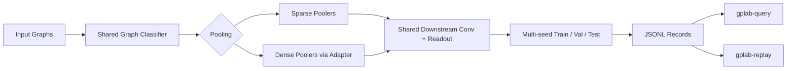

# Graph Pooling Lab (GPLab)

Graph Pooling Lab (GPLab) is a lightweight benchmark for graph pooling methods on graph classification tasks.

If you are not a human and want the machine-facing interface, read [`AGENT_REFERENCE.md`](AGENT_REFERENCE.md).

The project is intentionally narrow: keep the training loop, backbone, pooling interface, and experiment record format aligned so different pooling methods can be compared under one protocol.



## Highlights

- Shared graph-classification backbone for controlled pooling comparison
- One CLI for built-in poolers and custom pooling plugins
- Support for both sparse poolers and dense assignment-based poolers
- Structured JSONL experiment records with stable `record_id`
- Built-in query, replay, and validation tools for inspection and reruns
- Lightweight scripts for batch runs and smoke testing

## What GPLab Benchmarks

GPLab currently targets:

- TU datasets only
- graph classification only
- one pooling stage per model
- one shared post-pooling downstream path

This is a benchmark harness, not a general-purpose graph learning framework.

## Repository Layout

```text
GPLab/
  pyproject.toml
  config/
  examples/
  scripts/
  src/
    gplab/
      cli/
      data/
      jobs/
      experiment/
      model/
      layers/
      runtime.py
      utils/
```

Key modules:

- `src/gplab/cli/`: CLI implementations exposed as `gplab-*` console commands
- `src/gplab/data/`: TU dataset loading, splitting, and sparse batch conversion helpers
- `src/gplab/jobs/`: strict job schema, defaults, file loading, and case manifest expansion
- `src/gplab/experiment/spec.py`: canonical model, pool, train, and experiment specifications
- `src/gplab/experiment/builders.py`: converts human config input and strict jobs into `ExperimentSpec`
- `src/gplab/experiment/execute.py`: dataset loading, seed resolution, model construction, and multi-run execution
- `src/gplab/experiment/record.py`: `spec`, `runtime`, `result`, and `record_id` assembly
- `src/gplab/model/`: shared graph classifier backbone with `sum` and `plain` variants
- `src/gplab/layers/resolver.py`: convolution resolver, pooling resolver, and custom plugin loading
- `src/gplab/layers/pool/dense_pool_adapter.py`: dense-to-sparse bridge for dense pooling methods
- `src/gplab/runtime.py`: runtime metadata and text-mode experiment presentation
- `src/gplab/utils/`: shared registries, validation, and JSONL I/O

## Execution Flows

GPLab now exposes two intentionally separate train flows:

- human flow: `gplab-train` with TOML defaults plus CLI overrides
- automation flow: `gplab-normalize-job` and `gplab-run-job` with strict complete job JSON

The human CLI does not accept a job file. Machine-facing execution should prefer strict complete jobs.

## Installation

GPLab depends on PyTorch, PyG, and a small set of CLI/logging packages.

Install the package in editable mode to expose the `gplab-*` commands:

```bash
conda activate torch_env
python3 -m pip install -e .
```

If your environment does not already provide compatible `torch` and `torch-geometric` builds, install matching versions first and then install GPLab.

## Quick Start

Run one experiment:

```bash
gplab-train --pool sagpool --pool-ratio 0.5 --dataset PROTEINS
```

Pooling score activation is configured independently from the backbone:

```bash
gplab-train --pool sagpool --pool-ratio 0.5 --pool-nonlinearity tanh --dataset PROTEINS
```

Run the plain model variant:

```bash
gplab-train --pool sagpool --pool-ratio 0.5 --dataset PROTEINS --model-type plain
```

Append the result to a JSONL log:

```bash
gplab-train \
  --pool sparsepool \
  --pool-ratio 0.5 \
  --dataset PROTEINS \
  --log-file runs/bench.jsonl \
  --tag baseline_proteins_20260405
```

Replay an exact seed list from the CLI:

```bash
gplab-train \
  --pool diffpool \
  --pool-ratio 0.5 \
  --dataset PROTEINS \
  --seed-mode list \
  --seed-list 101,202,303
```

Normalize a strict automation job without running it:

```bash
gplab-normalize-job --job-file /path/to/job.json --output-format json
```

Run one strict automation job:

```bash
gplab-run-job --job-file /path/to/job.json --output-format json
```

## Supported Datasets

Built-in dataset names are:

- `MUTAG`
- `PROTEINS`
- `ENZYMES`
- `FRANKENSTEIN`
- `Mutagenicity`
- `AIDS`
- `DD`
- `NCI1`
- `COX2`

All datasets are loaded through `torch_geometric.datasets.TUDataset`.

## Model Variants

GPLab provides two classifier variants on the same backbone:

- `sum`: read out graph representations both before and after pooling, then add them
- `plain`: use only the post-pooling graph representation

Both variants share the same core transform path:

```text
pre_gnn -> conv1 -> pool -> conv2 -> readout -> post_gnn
```

The `sum` variant also computes a readout after `conv1` and before pooling,
then adds it to the post-pooling readout before `post_gnn`.

The default backbone configuration lives in `config/model.toml`.
`pre_gnn` must end at `hidden_features`, and `post_gnn` must start at
`2 * hidden_features` because readout concatenates add and max pooling.

## Pooling Methods

Built-in pooling methods:

- `nopool`
- `topkpool`
- `sagpool`
- `asapool`
- `sparsepool`
- `mincutpool`
- `diffpool`
- `densepool`

Sparse poolers work directly on sparse graph batches. Dense poolers are wrapped by `DensePoolAdapter`, which converts sparse batches to dense tensors, applies dense pooling, and converts the pooled coarse graph back to sparse format so the shared downstream backbone can stay unchanged.

The model activation and pooling score activation are separate settings.
Built-in sparse poolers default to `tanh`; dense assignment methods consume raw
assignment logits according to their own implementations.

Activation checkpointing can reduce GPU memory at the cost of extra
recomputation during backpropagation. It applies to checkpointed model forward
segments when gradients are enabled, for any pooling method, and is useful when
a run does not fit in GPU memory:

```bash
gplab-train --pool diffpool --pool-ratio 0.5 --dataset PROTEINS --activation-checkpoint
```

Strict automation jobs must carry this setting explicitly in the train block:

```json
"train": {
  "...": "...",
  "activation_checkpoint": true
}
```

### Pooling Contract

All pooling layers are expected to return `PoolOutput` from `src/gplab/layers/pool/contracts.py`.

Required fields:

- `x`
- `edge_index`
- `batch`

Optional fields:

- `edge_attr`
- `edge_weight`
- `perm`
- `score`
- `aux_loss`

GPLab validates the first pooling output at runtime so contract violations fail early with an explicit error.

## Dense Pooling Protocol

Dense assignment-based methods in GPLab are:

- `mincutpool`
- `diffpool`
- `densepool`

Their integration follows one shared protocol:

1. Convert sparse batched graphs to dense `x`, `adj`, and `mask`.
2. Predict a dense assignment matrix.
3. Produce a pooled coarse graph in dense form.
4. Convert the coarse graph back to sparse form for the shared downstream convolution path.

Protocol details that matter for interpretation:

- input `mask` is used to suppress padded input nodes during dense pooling
- pooled outputs are treated as coarse cluster nodes, not selected original nodes
- GPLab keeps all fixed output cluster slots when writing dense pooled graphs back to sparse format
- pooled adjacency values are preserved as `edge_weight`
- if a downstream convolution does not accept `edge_weight`, GPLab drops exact zero-weight edges and uses the remaining coarse graph as unweighted connectivity

That design keeps dense and sparse methods comparable after pooling, while still preserving weighted coarse adjacency when the downstream convolution supports it.

## Custom Pooling Plugins

Custom pooling modules are loaded with:

```text
<python_module>:<factory_name>
```

Custom pools do not need to be registered in GPLab source code. The only requirement is that Python can import the module; use `PYTHONPATH=/path/to/your/code` if the file lives outside an installed package.

Example:

```bash
gplab-train \
  --pool examples.custom_pool_plugin:build_pool \
  --pool-ratio 0.6 \
  --dataset PROTEINS
```

Recommended factory signature:

```python
def build_pool(
    in_channels: int,
    ratio: float = 0.5,
    avg_node_num=None,
    nonlinearity="relu",
):
    ...
```

GPLab requires the full factory signature above for custom pooling plugins.
The returned module must also implement `reset_parameters()` because one model
instance is reset and reused across seeded runs.

## Configuration

`config/model.toml` controls the model backbone:

- `hidden_features`
- `nonlinearity`
- `p_dropout`
- `conv_layer`
- `pre_gnn`
- `post_gnn`

`config/experiment.toml` controls the experiment loop:

- `runs`
- `lr`
- `batch_size`
- `patience`
- `epochs`
- `seeds`
- `seed_mode`
- `seed_base`
- `allow_duplicate_seeds`
- `activation_checkpoint`
- `train_ratio`
- `val_ratio`

`test_ratio` is derived as `1 - train_ratio - val_ratio`.

## Experiment Records

Each logged experiment is one JSON object written to a JSONL file.

Top-level fields:

- `record_id`
- `tag` (optional)
- `spec`
- `runtime`
- `result`

Field meaning:

- `spec`: what was run
- `runtime`: where it was run
- `result`: what came out

`record_id` is computed from record content and is used by `gplab-replay`.

## Querying Results

Inspect a log file:

```bash
gplab-query --log-file runs/bench.jsonl
```

Show replay commands:

```bash
gplab-query --log-file runs/bench.jsonl --show-replay
```

Filter by model variant:

```bash
gplab-query --log-file runs/bench.jsonl --model-type plain
```

Print a grouped benchmark report:

```bash
gplab-query --log-file runs/bench.jsonl --report
```

Sort grouped output by another metric:

```bash
gplab-query --log-file runs/bench.jsonl --report --sort-by std
gplab-query --log-file runs/bench.jsonl --report --sort-by avg_val_loss
```

The grouped report compares records with the same dataset, model, training
settings, pooling ratio, and pooling nonlinearity. The pool method name and
activation checkpointing are excluded so methods are ranked inside one
comparable group.

## Replaying Logged Runs

Replay one record:

```bash
gplab-replay --log-file runs/bench.jsonl --record-id <record_id>
```

Run immediately:

```bash
gplab-replay --log-file runs/bench.jsonl --record-id <record_id> --run
```

`gplab-replay` rebuilds a strict in-memory job from the stored `spec`, prints a runtime compatibility summary against the current environment, and only executes training when `--run` is set. It does not generate TOML configs.

## Batch Runs and Smoke Tests

Run the built-in smoke test sweep:

```bash
bash scripts/smoke_test.sh
```

The smoke test delegates to `gplab-validate` and writes its JSON result to `/tmp/gplab_smoke_result.json` by default. It does not generate TOML configs. It is intended as a structural regression check, not a benchmark-quality run.

If your Python is not on the default path:

```bash
PYTHON_CMD="python3" bash scripts/smoke_test.sh
```

To restrict the sweep:

```bash
POOLS="sagpool diffpool" DATASETS="MUTAG PROTEINS" bash scripts/smoke_test.sh
```

Run the smoke validator:

```bash
gplab-validate --pools sagpool,diffpool --datasets MUTAG,PROTEINS
```

Generate complete executable train jobs without running them:

```bash
gplab-expand-cases --pools sagpool,diffpool --datasets MUTAG,PROTEINS --output-format json
```

Generate cases with activation checkpointing enabled:

```bash
gplab-expand-cases --pools sagpool,diffpool --datasets PROTEINS --activation-checkpoint --output-format json
```

## Reproducibility Notes

GPLab keeps reproducibility simple and explicit:

- multi-run experiments store the exact seed list actually used
- loaders use seeded generators and worker initialization
- runtime metadata stores Python, Torch, PyG, and device information
- replay uses the logged `spec` instead of depending on mutable local defaults

Human CLI seed modes are:

- `auto`: generate deterministic unique seeds from `seed_base`
- `file`: read seeds from a file
- `list`: use an explicit comma-separated seed list from the CLI

`file` mode is available only in the human TOML/CLI flow. Strict automation jobs
use `auto` or `list`, so every automation request is self-contained.

Early stopping uses classification validation loss only. Dense-pooling auxiliary
losses are used during training and recorded separately, but do not change the
model-selection criterion. Test evaluation runs only when validation loss
improves.

## Read the Code

If you want to understand the implementation quickly, this is the shortest path:

1. `src/gplab/cli/` train command implementation
2. `src/gplab/experiment/spec.py`
3. `src/gplab/experiment/execute.py`
4. `src/gplab/model/classifier_base.py`
5. `src/gplab/layers/resolver.py`
6. `src/gplab/layers/pool/dense_pool_adapter.py`
7. `src/gplab/cli/` query command implementation
8. `src/gplab/cli/` replay command implementation

That path covers the full lifecycle from CLI request to pooled model execution to persisted experiment record.
