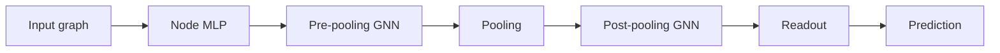

# Graph Pooling Lab (GPLab)

Graph Pooling Lab (GPLab) is a benchmark framework for evaluating hierarchical graph pooling methods under controlled and comparable experimental settings.

Graph pooling methods can differ not only in how they reduce a graph, but also in the graph information they accept and the type of pooled graph they produce. A benchmark that ignores these differences may unintentionally discard method-specific information or compare methods under incompatible settings.

GPLab is designed to make these issues explicit while keeping the benchmark workflow practical.

Read [PROTOCOL.md](./PROTOCOL.md) for the stable benchmark rules. Automation clients should also read [AGENT_REFERENCE.md](./AGENT_REFERENCE.md).

## Comparability-Aware Benchmarking

GPLab separates the model pipeline into:



```mermaid
flowchart LR
    A["Input graph"] --> B["Node MLP"]
    B --> C["Pre-pooling GNN"]
    C --> D["Pooling"]
    D --> E["Post-pooling GNN"]
    E --> F["Readout"]
    F --> G["Prediction"]
```

The surrounding architecture and experimental protocol are controlled, while the pooling operator is the component being compared.

Before an experiment is executed, GPLab checks whether:

- the selected pooling method supports the graph information it receives;
- the pooled graph can be correctly processed by the downstream GNN;
- valid information produced by pooling is not silently discarded;
- incompatible configurations are rejected rather than implicitly converted.

This allows different pooling methods to retain their own graph-coarsening behavior without forcing all methods into an artificially identical representation.


## Graph Connectivity

GPLab currently distinguishes between:

- **binary connectivity**, where edges represent connectivity only;
- **scalar-valued connectivity**, where edges additionally carry meaningful scalar values.

Pooling methods declare the connectivity transformations they support, and downstream GNN layers declare the connectivity they can process.


## Current Direction

GPLab is being developed as the experimental framework accompanying our study of **comparable evaluation in hierarchical graph pooling**.

The current focus is on:

- controlled pooling comparisons;
- explicit pooling input/output compatibility;
- reproducible experiment configuration;
- fair handling of pooled graph information;
- analysis of predictive performance, graph reduction, and computational behavior


## Install

GPLab requires Python 3.10 or newer and depends on PyTorch, PyTorch Geometric,
Typer, Rich, TOML, NumPy, and tqdm.

```bash
conda activate torch_env
python3 -m pip install -e .
```

## Quick Start

Run one human-oriented experiment:

```bash
gplab-train --pool sagpool --pool-ratio 0.5 --dataset PROTEINS
```

Append its `ExperimentRecord` to a JSONL log:

```bash
gplab-train \
  --pool sparsepool \
  --pool-ratio 0.5 \
  --dataset PROTEINS \
  --log-file runs/bench.jsonl \
  --tag baseline_proteins
```

Use the post-pooling-only model variant:

```bash
gplab-train \
  --pool sagpool \
  --pool-ratio 0.5 \
  --dataset PROTEINS \
  --model-variant plain
```

Run an exact seed list:

```bash
gplab-train \
  --pool diffpool \
  --pool-ratio 0.5 \
  --dataset PROTEINS \
  --seed-mode list \
  --seed-list 101,202,303
```

`gplab-train` is the human convenience entrypoint. Automation should submit one
Job JSON request per `gplab-run-job` process.

## Job Configuration

A Job JSON describes exactly one experiment case. Optional fields are filled
from GPLab's automation defaults before the request is validated.

```json
{
  "case": {
    "dataset": "PROTEINS",
    "pool": {
      "name": "sagpool",
      "ratio": 0.5,
      "nonlinearity": "tanh"
    },
    "model": {
      "hidden_features": 128,
      "nonlinearity": "relu",
      "p_dropout": 0.0,
      "pre_conv": "GCN",
      "post_conv": "GCN",
      "pre_gnn": [128],
      "post_gnn": [256, 128],
      "variant": "sum"
    },
    "training": {
      "runs": 10,
      "lr": 0.0005,
      "batch_size": 32,
      "patience": 50,
      "epochs": 500,
      "split": {
        "train": 0.8,
        "val": 0.1
      },
      "seeds": {
        "mode": "auto",
        "base": 20260320,
        "values": null,
        "allow_duplicates": false
      }
    }
  },
  "execution": {
    "log_file": "runs/bench.jsonl",
    "tag": "baseline_proteins",
    "activation_checkpoint": false
  }
}
```

Run from a file, inline JSON, or stdin:

```bash
gplab-run-job --job-file job.json --output-format json
gplab-run-job --job-json '{"case":{"dataset":"MUTAG","pool":{"name":"nopool","ratio":0.5},"training":{"runs":1,"epochs":1,"patience":0}}}' --output-format json
cat job.json | gplab-run-job --job-stdin --output-format json
```

Provide exactly one of `--job-file`, `--job-json`, or `--job-stdin`. With JSON
output, stdout contains exactly one response object; progress and diagnostics go
to stderr. Invalid jobs return `ok=false`, `kind="job_error"`, and a structured,
field-specific error.

A successful response contains the canonical `record`, a derived `summary`, and
entrypoint `context`. If several cases run concurrently, give them separate log
files or serialize JSONL appends externally.

See [AGENT_REFERENCE.md](AGENT_REFERENCE.md) for the complete schema and output
contract.

## Records, Querying, and Replay

One JSONL line is one canonical `ExperimentRecord` containing:

- the benchmark-defining `case`;
- execution-only settings;
- the resolved seeds and concrete split indices in `run_plan`;
- runtime metadata;
- per-run and aggregate results;
- a content-derived `record_id`.

Query records or build a grouped benchmark report:

```bash
gplab-query --log-file runs/bench.jsonl
gplab-query --log-file runs/bench.jsonl --report
gplab-query --log-file runs/bench.jsonl --model-variant plain
gplab-query --log-file runs/bench.jsonl --show-case --show-replay
```

Replay reconstructs a request from the stored case and resolved run plan. It
uses the recorded seed list and the exact stored train/validation/test indices:

```bash
gplab-replay --log-file runs/bench.jsonl --record-id <record_id>
gplab-replay --log-file runs/bench.jsonl --record-id <record_id> --run
```

Without `--run`, replay only reconstructs the request and checks selected runtime
metadata; JSON output includes that request in the top-level `job` field. Combine
`--run` with `--replay-log-file` to append a rerun to another JSONL log.

## Supported Datasets

GPLab currently supports graph classification on these TU datasets:

- `MUTAG`
- `PROTEINS`
- `ENZYMES`
- `FRANKENSTEIN`
- `Mutagenicity`
- `AIDS`
- `DD`
- `NCI1`
- `COX2`

The loader uses `TUDataset(..., use_node_attr=True)`. GPLab is a focused pooling
benchmark, not a general-purpose graph-learning framework; it currently supports
one pooling stage per model and one shared post-pooling path.

## Custom Pooling Profiles

Custom profiles use `<python_module>:<profile_name>`. The referenced object must
be a `PoolingProfile` with a builder and at least one declared signature:

```python
from gplab.graph import ConnectivityType
from gplab.layers.pool import PoolingProfile, PoolingSignature


CUSTOM_POOL_PROFILE = PoolingProfile(
    builder=build_pool,
    signatures=(
        PoolingSignature(
            ConnectivityType.BINARY,
            ConnectivityType.BINARY,
        ),
    ),
)
```

The builder receives `in_channels`, `ratio`, `avg_node_num`, and `nonlinearity`
and must return a `torch.nn.Module` (or `None` for no pooling). A pooling module
must:

- accept `x`, `edge_index`, `batch`, and optional `edge_weight`;
- return `PoolingOutput` with `x`, `edge_index`, and `batch`, plus optional
  `edge_weight`, `perm`, `score`, and `aux_loss`;
- implement `reset_parameters()`.

GPLab applies the declared signature to custom profiles during the same
compatibility validation as built-ins. See
[`examples/custom_pool_plugin.py`](examples/custom_pool_plugin.py) for a complete
profile.

## Configuration and Layout

`config/model.toml` defines model defaults, including the independent
`pre_conv` and `post_conv` roles. `config/experiment.toml` defines training,
split, seed, and execution defaults. CLI flags override these files before a
`BenchmarkCase` is built.

```text
src/gplab/
  benchmark/      # cases, requests, run plans, identities, compatibility
  cli/            # gplab-* entrypoints
  data/           # TU profiles, loading, and split helpers
  experiment/     # execution, records, querying, replay support
  graph/          # connectivity semantics
  jobs/           # Job JSON schema and request adapter
  layers/         # GNN and pooling profiles and adapters
  model/          # shared graph classifier
```
