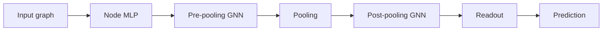

# Graph Pooling Lab (GPLab)

Graph Pooling Lab (GPLab) is a benchmark framework for evaluating hierarchical graph pooling methods under controlled and comparable experimental settings.

Graph pooling methods can differ not only in how they reduce a graph, but also in the graph information they accept and the type of pooled graph they produce. A benchmark that ignores these differences may unintentionally discard method-specific information or compare methods under incompatible settings.

GPLab is designed to make these issues explicit while keeping the benchmark workflow practical.

Read [PROTOCOL.md](./PROTOCOL.md) for the stable benchmark rules. Automation clients should also read [AGENT_REFERENCE.md](./AGENT_REFERENCE.md).

## Comparability-Aware Benchmarking

GPLab separates the model pipeline into:



```mermaid
flowchart LR
    A["Input graph"] --> B["Node MLP"]
    B --> C["Pre-pooling GNN"]
    C --> D["Pooling"]
    D --> E["Post-pooling GNN"]
    E --> F["Readout"]
    F --> G["Prediction"]
```

The surrounding architecture and experimental protocol are controlled, while the pooling operator is the component being compared.

Before an experiment is executed, GPLab checks whether:

- the selected pooling method supports the graph information it receives;
- the pooled graph can be correctly processed by the downstream GNN;
- valid information produced by pooling is not silently discarded;
- incompatible configurations are rejected rather than implicitly converted.

This allows different pooling methods to retain their own graph-coarsening behavior without forcing all methods into an artificially identical representation.


## Graph Connectivity

GPLab currently distinguishes between:

- **binary connectivity**, where edges represent connectivity only;
- **scalar-valued connectivity**, where edges additionally carry meaningful scalar values.

Pooling methods declare the connectivity transformations they support, and downstream GNN layers declare the connectivity they can process.


## Current Direction

GPLab is being developed as the experimental framework accompanying our study of **comparable evaluation in hierarchical graph pooling**.

The current focus is on:

- controlled pooling comparisons;
- explicit pooling input/output compatibility;
- reproducible experiment configuration;
- fair handling of pooled graph information;
- analysis of predictive performance, graph reduction, and computational behavior


## Install

GPLab uses [uv](https://docs.astral.sh/uv/) to manage its local environment and
locked dependencies. Python 3.10 is selected by `.python-version`; the lock keeps
the previously tested PyTorch 2.1.0, PyG 2.4.0, and NumPy 1.26.0 versions.

```bash
uv sync --locked
uv run gplab-train --help
uv run python -m unittest discover -s tests -v
uv run ruff check .
```

Prefix the commands below with `uv run`, or activate `.venv` first. No Conda
environment is required. `pyproject.toml` is the dependency source of truth;
commit `uv.lock` when intentionally updating dependencies with `uv lock`.
The default Linux PyTorch wheel includes CUDA dependencies and also runs on CPU.

To inspect fixed-cluster dense pooling or run one-epoch integration jobs:

```bash
uv run python scripts/check_dense_adapter.py
POOLS="nopool sagpool" DATASETS="MUTAG" bash scripts/smoke_test.sh
```

The smoke runner executes one Job JSON per subprocess and saves a combined
report to `RESULTS_PATH` (default `/tmp/gplab_smoke_result.json`). Dataset loading
may download TU datasets into `/tmp/TUDataset`.

## Quick Start

Run one human-oriented experiment:

```bash
gplab-train --pool sagpool --pool-ratio 0.5 --dataset PROTEINS
```

Append its `ExperimentRecord` to a JSONL log:

```bash
gplab-train \
  --pool sparsepool \
  --pool-ratio 0.5 \
  --dataset PROTEINS \
  --log-file runs/bench.jsonl \
  --tag baseline_proteins
```

Use the post-pooling-only model variant:

```bash
gplab-train \
  --pool sagpool \
  --pool-ratio 0.5 \
  --dataset PROTEINS \
  --model-variant plain
```

Run an exact seed list:

```bash
gplab-train \
  --pool diffpool \
  --pool-ratio 0.5 \
  --dataset PROTEINS \
  --seed-mode list \
  --seed-list 101,202,303
```

`gplab-train` is the human convenience entrypoint. Automation should submit one
Job JSON request per `gplab-run-job` process.

## Job Configuration

A Job JSON describes exactly one experiment case. Optional fields are filled
from GPLab's automation defaults before the request is validated.

```json
{
  "case": {
    "dataset": "PROTEINS",
    "pool": {
      "name": "sagpool",
      "ratio": 0.5,
      "nonlinearity": "tanh"
    },
    "model": {
      "hidden_features": 128,
      "nonlinearity": "relu",
      "p_dropout": 0.0,
      "pre_conv": "GCN",
      "post_conv": "GCN",
      "pre_gnn": [128],
      "post_gnn": [256, 128],
      "variant": "sum"
    },
    "training": {
      "runs": 10,
      "lr": 0.0005,
      "batch_size": 32,
      "patience": 50,
      "epochs": 500,
      "split": {
        "train": 0.8,
        "val": 0.1
      },
      "seeds": {
        "mode": "auto",
        "base": 20260320,
        "values": null,
        "allow_duplicates": false
      }
    }
  },
  "execution": {
    "log_file": "runs/bench.jsonl",
    "tag": "baseline_proteins",
    "activation_checkpoint": false
  }
}
```

Run from a file, inline JSON, or stdin:

```bash
gplab-run-job --job-file job.json --output-format json
gplab-run-job --job-json '{"case":{"dataset":"MUTAG","pool":{"name":"nopool","ratio":0.5},"training":{"runs":1,"epochs":1,"patience":0}}}' --output-format json
cat job.json | gplab-run-job --job-stdin --output-format json
```

Provide exactly one of `--job-file`, `--job-json`, or `--job-stdin`. With JSON
output, stdout contains exactly one response object; progress and diagnostics go
to stderr. Invalid jobs return `ok=false`, `kind="job_error"`, and a structured,
field-specific error.

A successful response contains the canonical `record`, a derived `summary`, and
entrypoint `context`. If several cases run concurrently, give them separate log
files or serialize JSONL appends externally.

See [AGENT_REFERENCE.md](AGENT_REFERENCE.md) for the complete schema and output
contract.

## Records, Querying, and Replay

One JSONL line is one canonical `ExperimentRecord` containing:

- the benchmark-defining `case`;
- execution-only settings;
- the resolved seeds and concrete split indices in `run_plan`;
- runtime metadata;
- per-run and aggregate results, including compact training and pooled-graph
  measurements;
- a content-derived `record_id`.

Each run selects its checkpoint using validation classification loss, restores
that checkpoint, and evaluates the test split once, recording `test_acc`.
The record includes training wall time, epochs trained, peak training CUDA
allocated memory (`peak_training_cuda_allocated_bytes`) when applicable, parameter
counts, and aggregate test-set input/output graph sizes. These measurements are
collected by the experiment runner and do not extend `PoolingOutput`.
The CUDA peak includes the training loop, validation, and checkpoint saving; it
is read after synchronization and before checkpoint restoration, final testing,
and structural-statistics collection.
Edge statistics retain both stored connectivity entries and strictly nonzero
entries, so dense zero-weight slots can be distinguished during analysis.

Query records or build a grouped benchmark report:

```bash
gplab-query --log-file runs/bench.jsonl
gplab-query --log-file runs/bench.jsonl --report
gplab-query --log-file runs/bench.jsonl --model-variant plain
gplab-query --log-file runs/bench.jsonl --show-case --show-replay
```

Replay reconstructs a request from the stored case and resolved run plan. It
uses the recorded seed list and the exact stored train/validation/test indices:

```bash
gplab-replay --log-file runs/bench.jsonl --record-id <record_id>
gplab-replay --log-file runs/bench.jsonl --record-id <record_id> --run
```

Without `--run`, replay only reconstructs the request and checks selected runtime
metadata; JSON output includes that request in the top-level `job` field. Combine
`--run` with `--replay-log-file` to append a rerun to another JSONL log.

## Supported Datasets

GPLab currently supports graph classification on these TU datasets:

- `MUTAG`
- `PROTEINS`
- `ENZYMES`
- `FRANKENSTEIN`
- `Mutagenicity`
- `AIDS`
- `DD`
- `NCI1`
- `COX2`

The loader uses `TUDataset(..., use_node_attr=True)`. GPLab is a focused pooling
benchmark, not a general-purpose graph-learning framework; it currently supports
one pooling stage per model and one shared post-pooling path.

## Custom Pooling Profiles

Custom profiles use `<python_module>:<profile_name>`. The referenced object must
be a `PoolingProfile` with a builder and at least one declared signature:

```python
from gplab.graph import ConnectivityType
from gplab.layers.pool import PoolingProfile, PoolingSignature


CUSTOM_POOL_PROFILE = PoolingProfile(
    builder=build_pool,
    signatures=(
        PoolingSignature(
            ConnectivityType.BINARY,
            ConnectivityType.BINARY,
        ),
    ),
)
```

The builder receives `in_channels`, `ratio`, `avg_node_num`, and `nonlinearity`
and must return a `torch.nn.Module` (or `None` for no pooling). A pooling module
must:

- accept `x`, `edge_index`, `batch`, and optional `edge_weight`;
- return `PoolingOutput` with `x`, `edge_index`, and `batch`, plus optional
  `edge_weight`, `perm`, `score`, and `aux_loss`;
- implement `reset_parameters()`.

`signatures` accepts sets, frozensets, lists, or tuples and is stored as a
`frozenset`. Declare each supported input/output pair explicitly. For example,
`{PoolingSignature(BINARY, BINARY), PoolingSignature(SCALAR, SCALAR)}` accepts
both inputs while preserving their distinct output domains. For a given input,
all declared outputs must be supported by the post-pooling encoder.

GPLab applies these declared signatures to custom profiles during the same
compatibility validation as built-ins. See
[`examples/custom_pool_plugin.py`](examples/custom_pool_plugin.py) for a complete
profile.

To check a specific group under one shared dataset/model configuration:

```python
from gplab.benchmark import ComparisonSetting, check_comparability

# model_config is the validated ModelConfig used by every compared method.
setting = ComparisonSetting(dataset="MUTAG", model=model_config)
result = check_comparability({"topkpool", "diffpool"}, setting)
print(result.comparable, result.input_types, result.incompatibilities)
```

The check finds input types available from the dataset and accepted by **every**
pool, then validates each pool's possible outputs against the post-encoder.
Scalar datasets can also provide binary topology by discarding edge weights.
All pools must use the same member of `result.input_types`; passing
`input_type=ConnectivityType.BINARY` to `ComparisonSetting` restricts the check
to that choice. Rejection reasons are grouped by input type, then pool.
`load_dataset(name, connectivity_type=...)` explicitly constructs a representation;
the existing training entry points continue to load the native default.

This checks declared graph-domain compatibility. Keep the actual dataset
instances, splits, and training rules shared when executing the comparison.
The single-pool API is `benchmark.compatibility.validate_pool_compatibility`;
`compatible_pools` lists compatible built-ins. The former single-pool
`validate_comparability`/`comparable_pools` names have been replaced to distinguish
compatibility checks from pool-set verdicts.

## Configuration and Layout

`config/model.toml` defines model defaults, including the independent
`pre_conv` and `post_conv` roles. `config/experiment.toml` defines training,
split, seed, and execution defaults. CLI flags override these files before a
`BenchmarkCase` is built.

```text
src/gplab/
  benchmark/      # cases, requests, run plans, identities, compatibility
  cli/            # gplab-* entrypoints
  data/           # TU profiles, loading, and split helpers
  experiment/     # training orchestration, measurements, records, queries
  graph/          # connectivity semantics
  jobs/           # Job JSON schema and request adapter
  layers/         # GNN and pooling profiles and adapters
  model/          # shared graph classifier
```
